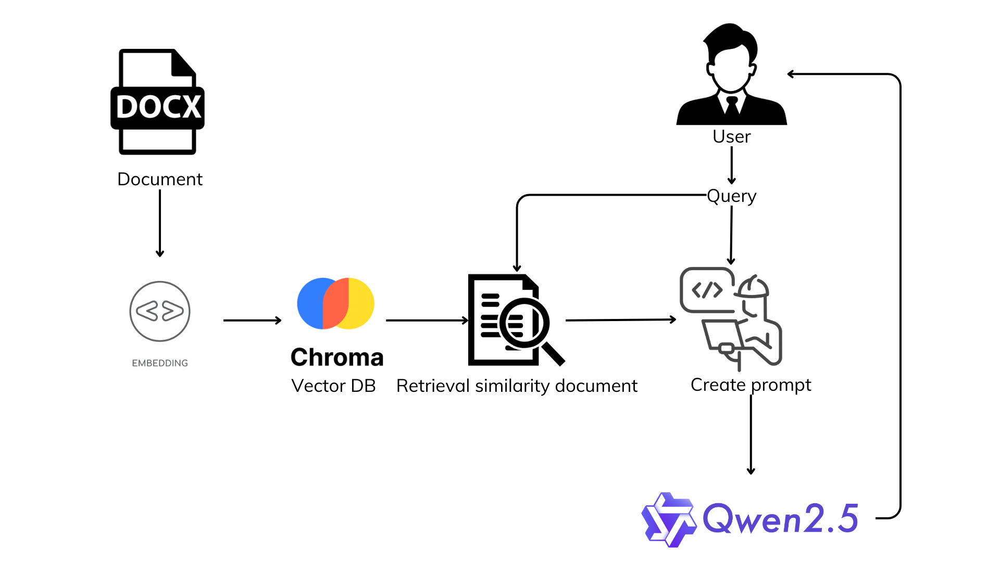

# Chatbot retrieval information from docx file
## Introduction
This project is a conversational chatbot developed using Python and natural language processing libraries:
* ChatBot can answer questions related to the provided documentation with format docx
* Chatbot can answer questions from users, based on a given topic
The Chatbot system works by retrieving data from a docx document, parsing that data and storing it in a vector database. When users asks a question, the system will retrieve information from the vector database related to the question. Then create a prompt based on the context-information retrieved from the document and the question. The prompt will be sent to the model. The Qwen model will give an answer based on that prompt.

## Le Thanh Hien